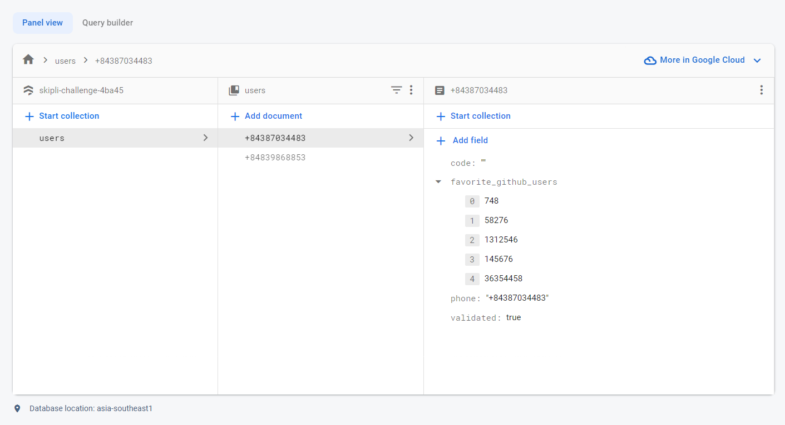
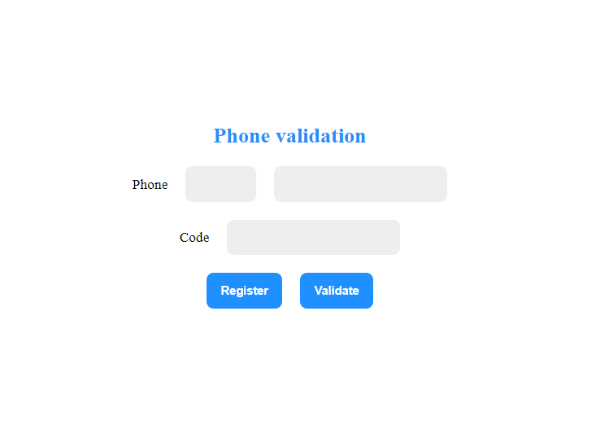
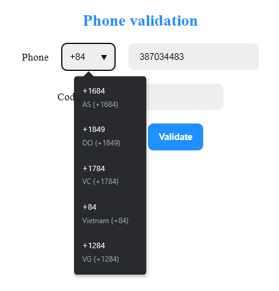
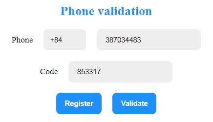
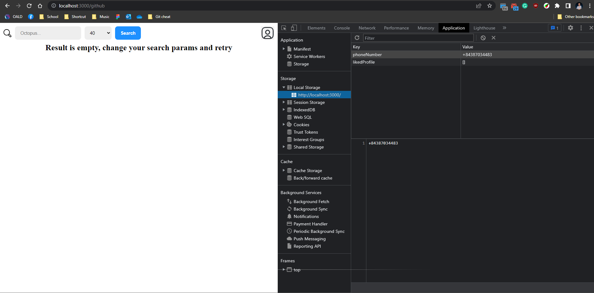
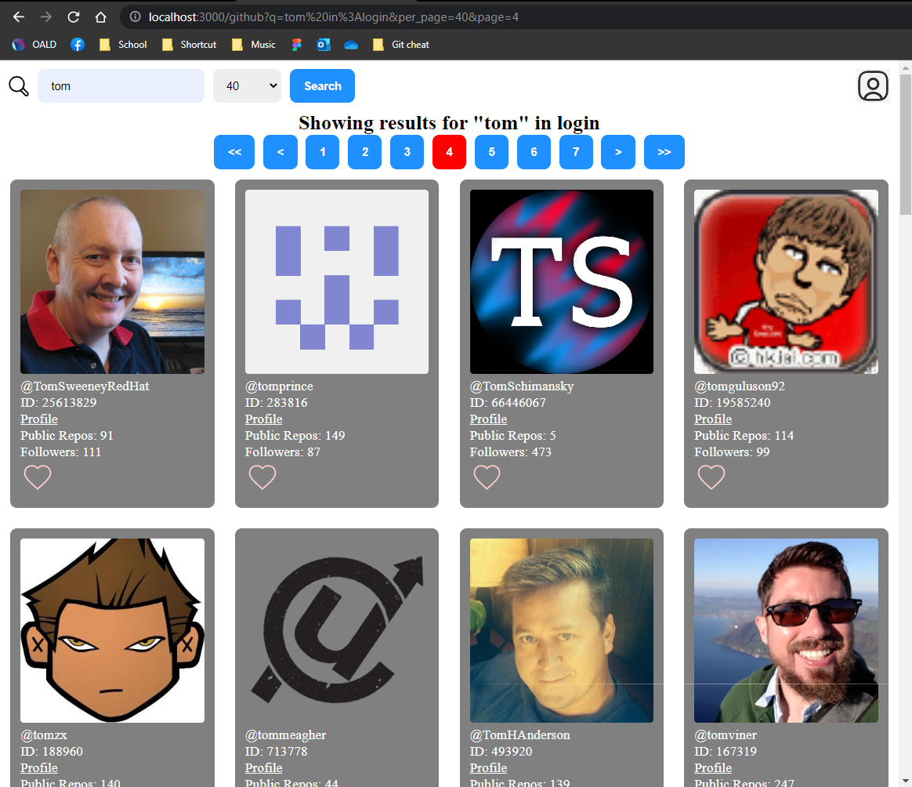
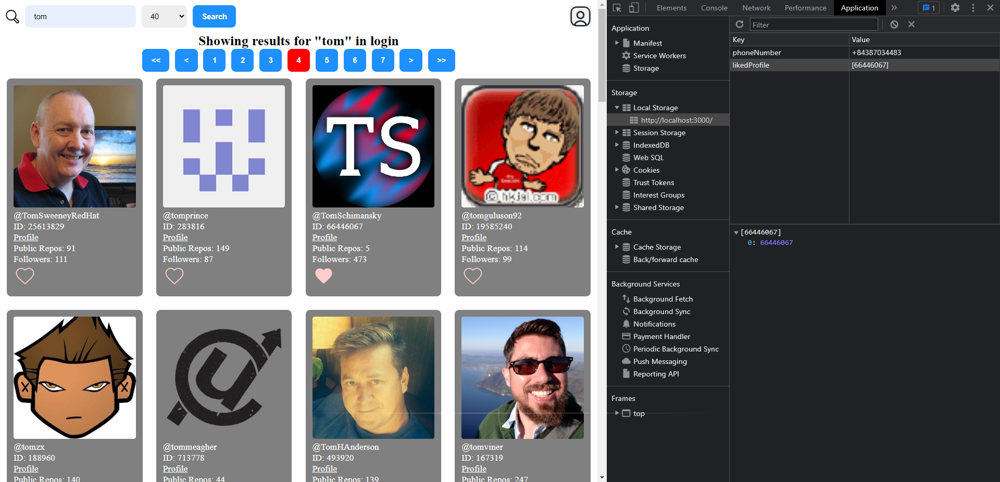
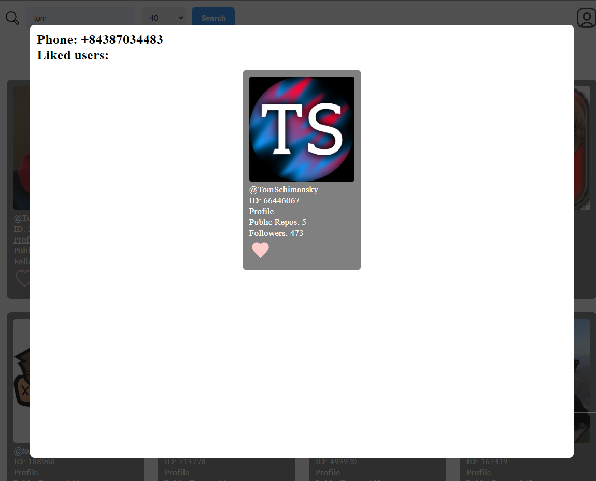

# Skipli Challenge - Code Challenge 2

## Structure

- The project is divided into two folders, `frontend` and `backend`. The `frontend` folder contains the React application, while the `backend` folder contains the Express.js application.

<br/>

### Folder `frontend`

- The frontend application was bootstrapped using `create-react-app`. The root of the project includes 2 folders `public` and `src`, in addition to `.gitignore`, `package.json`, `package-lock.json` and `README.md`.

<br/>

#### Folder `public`

- `public` folder contains any static files that are used by the application, such as `index.html` and `favicon.ico`.

- These files are not processed by Webpack and will be copied as is to the `build` folder for serving to clients.

<br/>

#### Folder `src`

- The `src` folder contains the source code for the application.

- The `index.js` file is the entry point for the application. The `App.jsx` file contains the main component for the application. The `index.css` file contains the global styles for the application.

- The `assets` folder contains any static assets that are used by the application, such as `*.json` for loading country code and `*.svg` for the icons.

- The `components` folder contains any re-usable UI logic for the entire application. Components should only focus on rendering UI and contain minimal business logic. All components are also styled using `css module` supported by `create-react-app` through the `*.module.css` file extension to avoid any naming collision. All components are exported using an `index.js` module file to allow for cleaner imports.

- The `constants` folder contains any constants that are used by the application, such as `routes.js` for routing and `regex.js` for regular expression.

- The `containers` contains Containers for the application. Containers are responsible for most of the business logic used in the application, mainly fetching, passing data to components and handling users interactions. All containers are also styled using `css module`.

- The `hooks` folder contains custom hooks.

<br/>

### Folder `backend`

- The backend application contains `server.js` as the entry point for the application. It uses `express` for setting up the server, middleware and routing.

- The backend contains `.env` file for storing environment variables. The `.env` file should **not** be included in the repository for security reasons. However, for demonstration purposes, the `.env` file is included in the repository.

- `serviceAccount.json` is the account key for the Firebase project. It is used for authenticating the application with Firebase. It should also **not** be included in the repository.

- It also contains the usual files such as `.gitignore`, `package.json` and `package-lock.json`.

<br/>

#### Folder `routes`

- The `routes` folder contains the routes for the application. Each route is an instance of `Router` from `express`, which is then used by `express` in `server.js` to set up the routes. Each route also responsible for routing the request to the appropriate controller.

<br/>

#### Folder `controllers`

- The `controllers` folder contains the controllers for the application. Each controller is responsible for handling the request and returning the appropriate response. Each controller is also responsible for validating the request and returning the appropriate error response.

<br/>

#### Folder `constants`

- The `constants` folder contains the constants for the application. It contains `routes.js` for routing and `regex.js` for regular expression.

<br/>

## Running the application

<br/>

### Running the `frontend`

1. When opening the project in the terminal, navigate to the `frontend` folder using:

```bash
cd frontend
```

2. Install all dependencies using:

```bash
npm install
```

3. Run the application using:

```bash
npm start
```

4. The application will be available at [http://localhost:3000](http://localhost:3000).

<br/>

### Running the `backend`

1. When opening the project in the terminal, navigate to the `backend` folder using:

```bash
cd backend
```

2. Install all dependencies using:

```bash
npm install
```

3. Change the `GITHUB_ACCESS_TOKEN` to your own GitHub access token in `.env` file.

4. Run the application using:

```bash
npm start
```

5. The application will be available at [http://localhost:4000](http://localhost:4000).

## Application in action

<br/>

### `Firebase`

- The application uses `Firebase Firestore`, a document database, to store the data about users. The data is stored in the `users` collection.

- Access to the database is done through the `Firebase Admin SDK`. From which you can create, get or update the document related to users. The current rule sets allow for read and write access to all users.

- Each user's document is uniquely identified using the `phoneNumber` that the user provided.



### `Validate phone number`

1. Accessing the site on [http://localhost:3000](http://localhost:3000) will bring the user to the validation page.

   

2. Country code is provided using a `countryCode.json` file through dropdown; user can type in the country name or country code to filter country code.

   > Due to Twilio's trial account, only the currently verified number "+84387034483" can receive messages.
   >
   > You can switch out the API key in the `.env` file to send message to your number.

   

3. Hitting register will call `createNewAccessCode()`. A 6-digit code is generated using `Math.random()` since uniqueness is not required.

   - Backend will then attempt to send the message to the number received from Frontend.
   - If succeeded, the code and phone number will be saved to `Firestore`. And a success message is displayed to the user.

     

   - Any error will also be displayed to the user, such as invalid country code/phone number, missing information, duplicated account or Internal Server error.

4. Receiving the 6-digit code and entering it will call `validateAccessCode()`.

   - Successful message sent will receive a 6-digit that can be enter for validation.

     

   - Entering the 6-digit code

     

   - Successful validation will set the phone number in browser's `localStorage` and navigate the user to [http://localhost:3000/github](http://localhost:3000/github)

     

   - The user's document in `Firestore` will also be updated, setting the accessCode field to an empty string and toggle validated field to `true`.

     

### `Search Github's users`

1. Users can enter the keyword they want to search for inside Github profiles' login.

   

2. Users can select the number of result per page that they want to received. These includes 40, 60 and 100.

3. Hitting search will include the query parameters inside the URL and call `searchGithubUsers()`.

   > `q` is mandatory, if no value for `q` is provided, backend will throw `Invalid request`
   >
   > If no value is provided for `page`, it will default to `1`.
   >
   > If no value is provided for `per_page`, it will default to `40`.

   - The result will then be fetched from backend and display to users in a grid format with each Profile represented by a Card
   - Each card includes the `login` or the unique username of the account, `id`, `html_url` to the Github's profile, `public_repos` is the number of public repos and the number of `followers`.
   - Each card also contains a heart that lights up when the profile is liked by the user.

     

   - A header is also shown with the search term in quotation.

4. Pagination also uses `searchGithubUsers()`

   - Pagination will be available on both the top and bottom.
   - Hitting the corresponding number will navigate the user to that page.
   - `>` and `<` navigate the user forward and back by one page, respectively.
   - `>>` and `<<` navigate the user to the first page and last page.

     

   - Navigating using pagination will update the URL accordingly.
   - A new result set will be fetch from backend.

   > All buttons/pagination will be disabled on navigate to prevent spamming.
   >
   > Refreshing will also refetch the current page automatically based on the query in the URL.

5. Liking users

   - Clicking the heart icon will call `likeGithubUser()`.
   - If success, the `id` of the Github's profile the will be updated in `favorite_github_users` field of the user's document on `Firestore`, added to `likedProfile` in `localStorage` for faster fetching when reloading.

     

     

   - The heart icon will be filled on success.
   - Clicking on the heart icon of a `"liked"` user will `"unlike"` them. Removing them from `Firestore` and `localStorage`.

   > Reloading the page will first search for the list of `likedProfile` from `localStorage`.
   >
   > If available, it will be used to display the liked users in the search.
   >
   > If not, it will fetch the list of `likeProfile` from backend using `getUserProfile()`.

6. Showing profile modal

   - Clicking on the profile icon will toggle the modal. Clicking on the outside of the modal will close it.
   - The list of `"liked"` users' id are passed down from main page, which will then be used to fetch their profiles from backend using `findGithubUserProfile()`.

     

   - The list here also used the same `Card` component as the ones used in the search grid.
   - Clicking on the heart here will also have the same effect as it does in the search grid.
